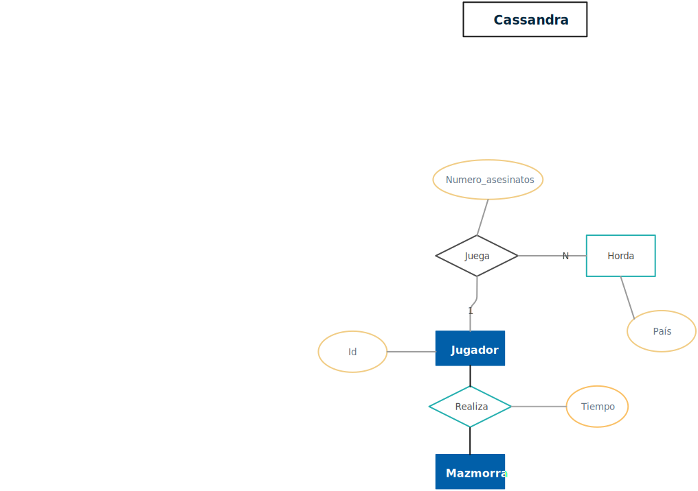
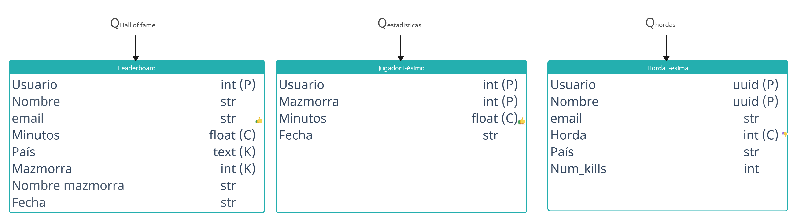

# Práctica 1 BBDD [Cassandra]
### Completar 3 leaderbords:
1 y 2 son querys a una base de datos con los tiempos en sacar mazmorras
1. Hall of Fame por país 
    - Por cada país, por cada mazmorra: Top 5 jugadores más rápido
    - Muestra los tiempos de cada uno
    - Importante consistencia
    - No tan importante la velocidad de actualización

1. Estadísticas jugador
       No sería que para determinada mazmorra determinado jugador el orden de cuanto a tardao en acabarla??
    - Muestra tiempo que ha tardado en completar cada mazmorra ordenado de menor a mayor
    - Importante consistencia
    - No tan importante la velocidad de actualización 

La 3 es otra parte de la base de datos, relacionado con nº de bichos matados en esa horda en específico

3. Hordas:
    - Disponible **solo** para algunos jugadores (todos del mismo país)
    - Muestra N jugadores que más monstruos ha matado
    - Importante velocidad de actualización
    - No tan importante la consistencia

### Pasos a seguir
- [x] 0. Crear el readme especificando el problema y como enfocarlo
- [ ] 1. Definir bien las querys a realizar con cada leaderboard
- [x] 2. Crear las tablas teniendo en cuenta las primery, cluster y static keys (lo que sea eso)
- [x] 3. Tener en cuenta para cada una el tipo de cassandra según que es más importante
- [ ] 4. Crear las query cql
- [x] 5. Crear querys sql para obtener los datos
- [ ] 6. Actualizar tablas escritura?
 
### Tareas 
- [ ] 1. Diseña una base de datos Cassandra para dar servicio a las lecturas y escrituras anteriores. Argumenta tus decisiones de diseño. 
- [x] 2. Crea las consultas .sql necesarias para exportar los datos de la base de datos relacional a ficheros .csv. Los ficheros deberán tener un formato acorde al diseño del punto 1.  
- [x] 3. Prepara un cluster local de 3 nodos todos en el mismo rack y datacenter. 
- [x] 4. Haz un fichero .cql que creen tu diseño en Cassandra y cargue los ficheros .csv creados en el paso 2. Se debe utilizar un factor de replicación de 2 y tener en cuenta que se las pruebas se ejecutaran en un cluster local. 
- [ ] 5. [OPCIONAL] Si el diseño lo necesita, actualiza la tabla de escrituras para incluir cualquier modificación que sea necesaria en la información que se le debe proporcionar al servidor. 
- [ ] 6. Haz un fichero .cql que realice las consultas de escritura y lectura necesarias. Incluye el nivel de consistencia de cada consulta, teniendo en cuenta las características de los diferentes rankings.

---

### Entidad Relación

### Chebotko Diagram
Editar: https://app.creately.com/d/etfwJcqGDeY/edit 

### Decisiones:

#### Top horde
Debido a que es importante la velocidad de lectura, el order by lo mantenemos en la clustering key, aunque para actualizarla haya que hacer un delete/insert (más costoso)
